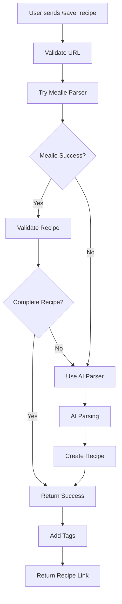

# 🍳 Mealie Discord Import Bot

A Discord bot that automatically imports recipes from links to the Mealie application with AI fallback support.

## ✨ Features

- **Smart Recipe Processing** - Uses Mealie parser first, falls back to OpenAI for complex recipes
- **Recipe Validation** - Ensures recipes contain required ingredients and instructions
- **Automatic Tagging** - Tags recipes with "Discord Import" and "Verify"
- **AI-Powered Fallback** - Uses OpenAI GPT to parse recipes when Mealie fails
- **Docker Support** - Easy deployment with Docker and Docker Compose
- **Error Handling** - Clear success/failure messages with recipe links
- **Slash Commands** - Modern Discord slash command interface

## 🚀 Quick Start

### Prerequisites

- Docker and Docker Compose
- Mealie instance
- Discord Bot (created in Discord Developer Portal)
- OpenAI API key (optional, for AI fallback)

### 1. Clone Repository

```bash
git clone <repository-url>
cd mealie-discord-import
```

### 2. Configuration

Copy and edit the environment file:

```bash
cp .env.example .env
```

Fill in your configuration in `.env`:

```env
# Discord Bot Configuration
DISCORD_TOKEN=your_discord_bot_token_here

# Mealie Configuration
MEALIE_BASE_URL=https://your-mealie-instance.com
MEALIE_API_TOKEN=your_mealie_api_token_here

# AI Configuration (Optional)
OPENAI_API_KEY=your_openai_api_key_here
AI_ENABLED=true
AI_MODEL=gpt-3.5-turbo

# Bot Settings
BOT_LOG_LEVEL=INFO
BOT_TIMEOUT=30

# Recipe Settings
DEFAULT_RECIPE_TAGS=Discord Import,Verify
REQUIRE_INSTRUCTIONS=true
REQUIRE_INGREDIENTS=true
```

### 3. Run with Docker

```bash
# Build and start
docker-compose up -d --build

# View logs
docker-compose logs -f
```

### 4. Run as Systemd Service (Alternative)

For production deployments or LXC containers, you can run the bot as a systemd service:

```bash
# Run the installation script
sudo ./install-service.sh
```

The installer offers two deployment options:
- **Native Python**: Runs directly without Docker (recommended for LXC containers)
- **Docker Compose**: Manages Docker containers via systemd

After installation, manage the service with:

```bash
# Start/stop/restart
sudo systemctl start mealie-discord-bot
sudo systemctl stop mealie-discord-bot
sudo systemctl restart mealie-discord-bot

# View status and logs
sudo systemctl status mealie-discord-bot
sudo journalctl -u mealie-discord-bot -f

# Enable autostart at boot
sudo systemctl enable mealie-discord-bot
```

For detailed systemd documentation, see [systemd/README.md](systemd/README.md).

## ⚙️ Configuration

### Discord Bot Setup

1. Go to [Discord Developer Portal](https://discord.com/developers/applications)
2. Create a new application
3. Go to "Bot" section
4. Copy the bot token
5. Enable these intents:
   - Message Content Intent
   - Server Members Intent
6. Add bot to your server with proper permissions

### Mealie Setup

1. Log into your Mealie instance
2. Go to Settings > API Tokens
3. Create a new API token
4. Copy token to `.env` file

### OpenAI Setup (Optional)

1. Get API key from [OpenAI Platform](https://platform.openai.com/api-keys)
2. Add to `.env`:
   ```env
   OPENAI_API_KEY=your_key_here
   AI_ENABLED=true
   ```

## 📖 Usage

### Slash Commands

- `/save_recipe url:<recipe_url>` - Save a recipe from URL
- `/mealie_info` - Show bot information and help

### How It Works

1. **Primary Path**: Bot tries Mealie parser first
2. **Validation**: Checks if recipe has ingredients and instructions
3. **AI Fallback**: If Mealie fails or recipe is incomplete, uses OpenAI
4. **Success**: Returns recipe link and confirmation
5. **Error**: Clear error messages with suggestions

### Examples

```
/save_recipe url:https://www.allrecipes.com/recipe/12345/amazing-pasta/
```

## 🔧 Development

### Project Structure

```
mealie-discord-import/
├── src/
│   ├── main.py              # Application entry point
│   ├── bot/
│   │   ├── __init__.py
│   │   └── discord_bot.py   # Discord bot logic
│   └── mealie/
│       ├── __init__.py
│       ├── client.py        # Mealie API client
│       └── models.py        # Data models
├── config/
│   └── settings.py          # Configuration management
├── systemd/
│   ├── mealie-discord-bot.service        # Systemd service (native)
│   ├── mealie-discord-bot-docker.service # Systemd service (docker)
│   └── README.md                         # Systemd documentation
├── tests/                   # Unit tests
├── docker-compose.yml       # Docker services
├── Dockerfile              # Container definition
├── install-service.sh      # Systemd service installer
├── requirements.txt        # Python dependencies
├── .env.example           # Example environment variables (template)
└── .env                   # Environment variables (gitignored, create from .env.example)
```

### Adding New Features

#### New Slash Commands

Add to `src/bot/discord_bot.py`:

```python
@self.tree.command(name="new_command", description="Command description")
async def new_command(interaction: discord.Interaction, param: str):
    """New command implementation"""
    # Your code here
```

#### Extending AI Capabilities

Modify `src/mealie/client.py`:

```python
async def custom_ai_parsing(self, url: str) -> Dict[str, Any]:
    """Custom AI parsing logic"""
    # Implementation
```

## 📝 Logging

The bot provides detailed logging. View logs with:

```bash
docker-compose logs -f mealie-bot
```

Log levels can be adjusted in `.env`:

```env
BOT_LOG_LEVEL=DEBUG  # DEBUG, INFO, WARNING, ERROR
```

## 🐛 Troubleshooting

### Bot Not Responding

1. Check Discord token validity
2. Ensure bot has proper server permissions
3. Verify bot intents are enabled
4. Check logs for connection errors

### Mealie Connection Issues

1. Verify Mealie URL is accessible
2. Check API token validity
3. Ensure Mealie API is enabled
4. Test Mealie instance connectivity

### AI Not Working

1. Verify OpenAI API key
2. Check API quota/limits
3. Ensure `AI_ENABLED=true` in config
4. Test API key with OpenAI directly

### Recipe Validation Issues

Adjust validation settings in `.env`:

```env
REQUIRE_INSTRUCTIONS=false  # Allow recipes without instructions
REQUIRE_INGREDIENTS=false  # Allow recipes without ingredients
```

## 🔄 Processing Flow



## 🔒 Security

### Environment Variables

**IMPORTANT**: Never commit your `.env` file to version control. The `.env` file contains sensitive information like API tokens and passwords.

- ✅ `.env` is already in `.gitignore` and will not be committed
- ✅ Use `.env.example` as a template for your configuration
- ✅ Keep your `.env` file secure and never share it publicly
- ✅ Rotate your API tokens regularly
- ✅ Use environment variables for all sensitive configuration

### Best Practices

1. **Copy `.env.example` to `.env`** before starting:
   ```bash
   cp .env.example .env
   ```

2. **Fill in your actual values** in `.env` (this file is gitignored)

3. **Never commit**:
   - `.env` files
   - API tokens or keys
   - Passwords or credentials
   - Any sensitive configuration

4. **Check before committing**:
   ```bash
   git status
   git diff
   ```
   Ensure no `.env` files appear in the output.

## 📄 License

This project is licensed under the MIT License. See LICENSE file for details.

## 🤝 Support

If you encounter issues or have questions:

1. Check application logs
2. Verify your configuration
3. Create an issue in the repository

## 🚀 Roadmap

- [x] Mealie integration
- [x] AI fallback with OpenAI
- [x] Docker deployment
- [x] Slash commands
- [x] Systemd service support
- [ ] Multiple AI providers support
- [ ] Recipe image processing
- [ ] Bulk recipe import
- [ ] Recipe categorization
- [ ] Web dashboard
- [ ] Mobile app companion
